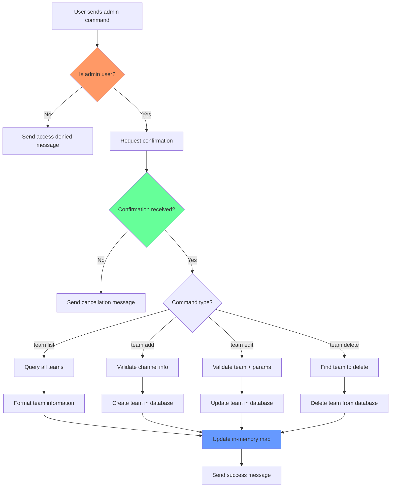

# Team Admin Command Workflow

## Description

This flowchart shows the complete workflow for admin commands:

- User authorization check
- Confirmation requirement for destructive operations
- Command routing to appropriate handlers
- Database operations and in-memory state updates
- Success/error message handling
