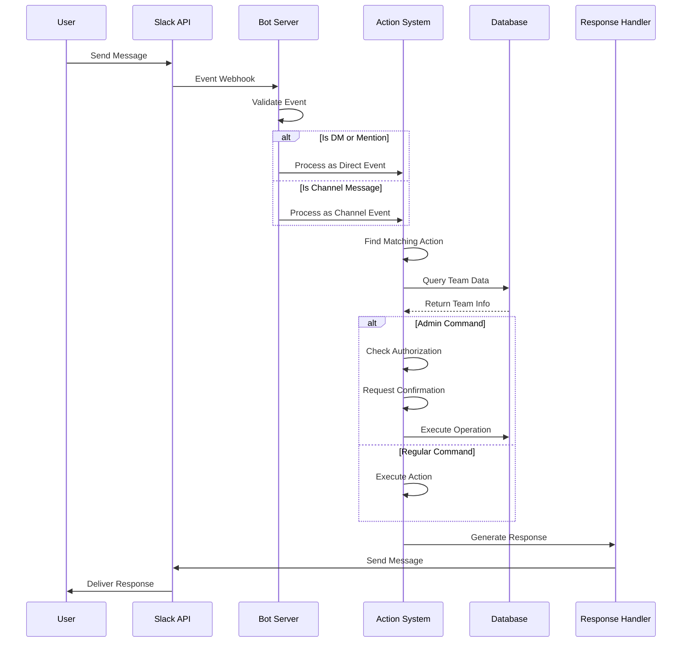

# Team Slack Bot - Event Flow

## Description

This sequence diagram shows the complete flow of events when a user interacts with the bot:

- Message reception and validation
- Event routing based on message type
- Action processing and database interaction
- Authorization and confirmation flow for admin commands
- Response generation and delivery
