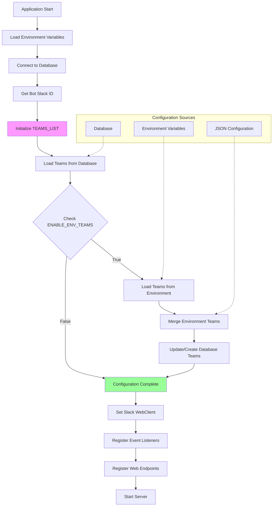

# Configuration Hierarchy

## Description

This diagram shows:

- Application initialization sequence
- Configuration loading priority (Database > Environment)
- Configuration merging and synchronization
- Service initialization flow
- Server startup process
