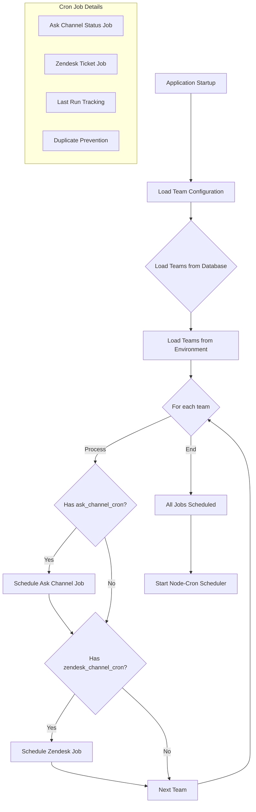

# Cron Job Scheduling System

## Description

This flowchart illustrates:

- Application startup sequence
- Team configuration loading process
- Cron job scheduling logic for each team
- Conditional scheduling based on team settings
- Prevention of duplicate job execution
