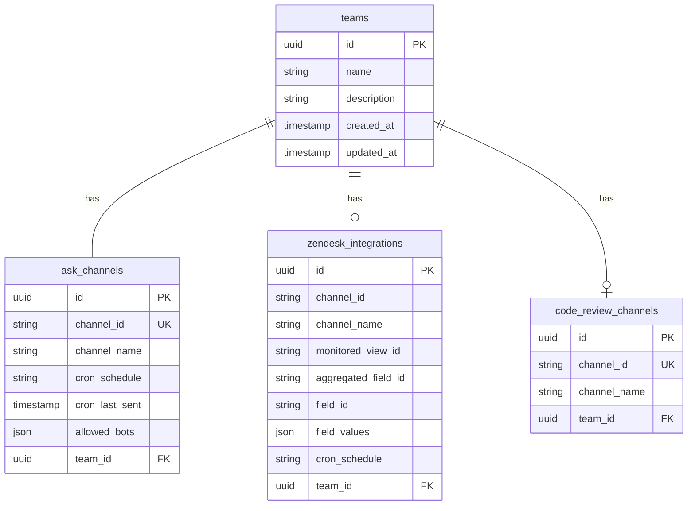

# Team Slack Bot - Database Schema

## Description

This Entity Relationship Diagram shows:

- Database schema structure
- Relationships between entities
- Primary keys (PK), Foreign keys (FK), and Unique constraints (UK)
- Column types and constraints
- One-to-one and one-to-optional relationships
