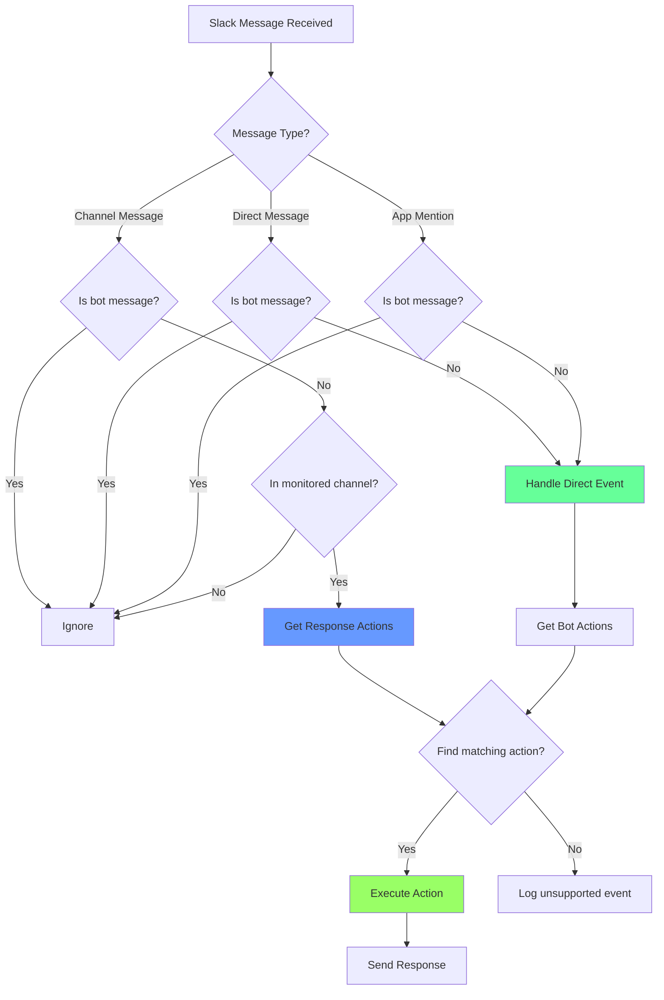

# Message Processing Pipeline

## Description

This diagram shows the message processing pipeline:

- Message type classification
- Bot message filtering
- Event routing to appropriate handlers
- Action matching and execution
- Response generation and delivery
