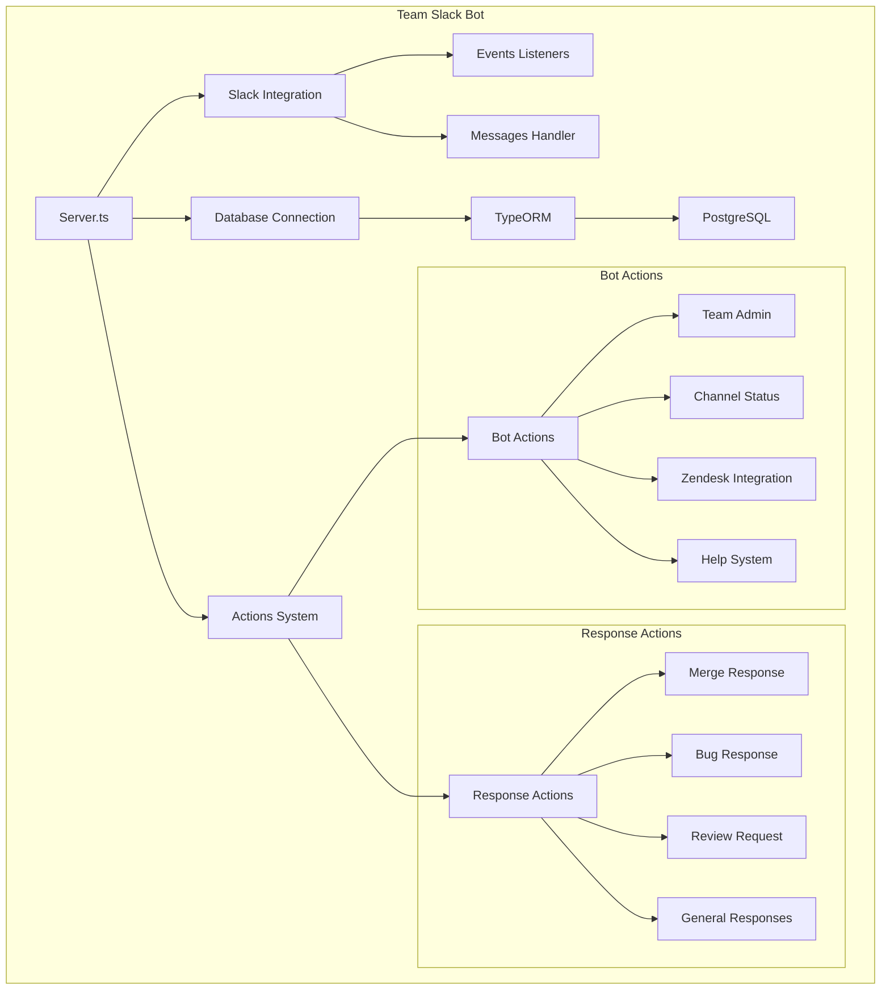

# Team Slack Bot - System Architecture

## Description

This diagram shows the high-level architecture of the Team Slack Bot, displaying:

- Main application entry point (Server.ts)
- Key architectural components
- Integration points
- Action system organization
- Database infrastructure
