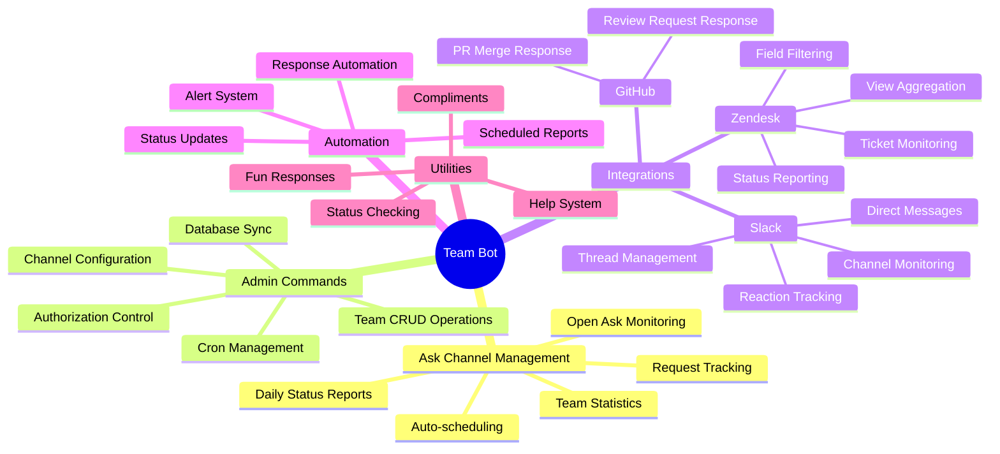

# Team Slack Bot Features

```mermaid
mindmap
  root((Team Bot))
    Ask Channel Management
      Daily Status Reports
      Request Tracking
      Team Statistics
      Open Ask Monitoring
      Auto-scheduling
    Admin Commands
      Team CRUD Operations
      Channel Configuration
      Cron Management
      Database Sync
      Authorization Control
    Integrations
      Zendesk
        Ticket Monitoring
        View Aggregation
        Field Filtering
        Status Reporting
      GitHub
        PR Merge Response
        Review Request Response
      Slack
        Direct Messages
        Channel Monitoring
        Thread Management
        Reaction Tracking
    Automation
      Scheduled Reports
      Response Automation
      Status Updates
      Alert System
    Utilities
      Help System
      Status Checking
      Compliments
      Fun Responses
```

## Description

This mindmap visualizes all the key features and capabilities of the Team Slack Bot, organized by functional areas.
